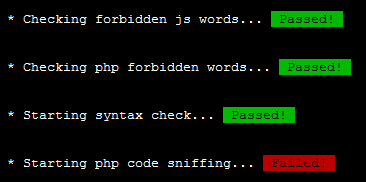

# Basic git hooks for PHP

## Intro

Information about git hooks on the internet is too scattered so I decided to make my own.

IMPORTANT! The hooks are not plug-n-play.
You will still need to adjust them to your environment.
By default all checks are triggered.

External links:
- https://www.kernel.org/pub/software/scm/git/docs/githooks.html
- http://git-scm.com/book/en/Customizing-Git-Git-Hooks

## Requirements

- *nix flavour
- php
- phpunit
- phpcs
- phpdoc

## Installation

For client-side hooks (`pre-commit` and `post-merge`) 
copy `CONFIG` file and the corresponding hook file to `.git/hooks/` directory on local repository.

For server-side hooks (`pre-receive`)
copy `CONFIG` file and the corresponding hook file to `hooks/` directory on remote repository.

## Pre Commit

"This hook is invoked by `git commit`, and can be bypassed with `--no-verify` option."

### Actions
- only checks indexed files contents
- forbid words like `var_export`, `var_dump`, `print_r` in php files
- enforce a coding standard with PhpCodeSniffer
- check php syntax with `php -l`
- run unit tests with `phpunit`
- forbid `console.*` in js files

Demo:

## Post Merge

"This hook is invoked by git merge, which happens when a `git pull` is done on a local repository."

### Actions
- run DDL sync script (@TODO) ([https://github.com/mrjulio/mysql-revisioning-tool])
- run phpdoc (@TODO)
- clean cache and other tasks (@TODO)

## Pre Receive

"This hook is invoked by git-receive-pack on the remote repository, which happens when a `git push` 
is done on a local repository."

### Actions
- forbid words like `var_export`, `var_dump`, `print_r` in php files
- enforce a coding standard with PhpCodeSniffer
- check php syntax with `php -l`
- forbid `console.*` in js files

## Credits

- http://stackoverflow.com/users/13923/larryh (Git pre-commit hook : changed/added files)
- https://github.com/s0enke/git-hooks
- http://www.craftitonline.com/2011/08/php-pre-commit-hook/
- http://www.masnun.com/2012/03/18/running-phpunit-on-git-hook.html
- http://stackoverflow.com/questions/2539404/git-pre-receive-hook-to-launch-php-codesniffer
- http://codeutopia.net/blog/2011/06/30/how-to-automatically-run-unit-tests-from-a-git-push/
- https://github.com/brightbox/puppet-git-receiver/blob/master/puppet-git-receiver-update-hook
